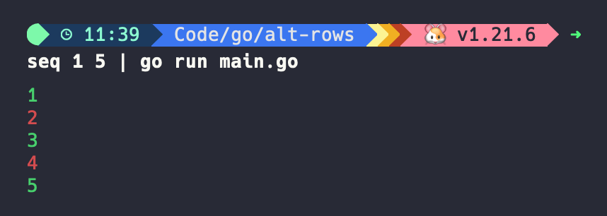
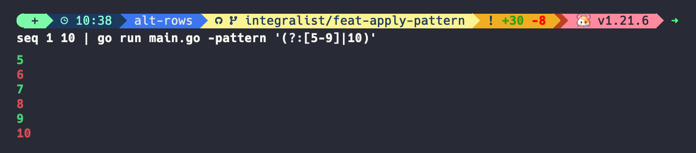

# alt-rows

Simple program that streams data piped into stdin and colors each line with alternative colors.

## Examples

```
seq 1 5 | go run main.go
```



```
seq 1 5 | go run main.go -pattern '(?:[5-9]|10)'
```



## Install

```
go build
sudo cp ./alt-rows /usr/local/bin/
```
